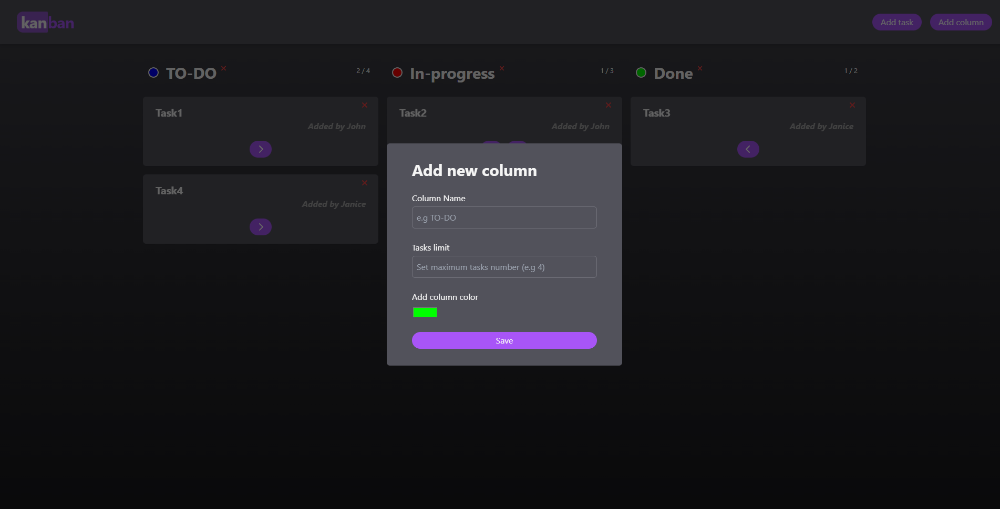

# KanbanApp

See the live version of [KanbanApp](https://mikepatch.github.io/KanbanApp--React/build/).

KanbanApp is a project developed to practice modern React, including functional components, hooks, and context. It's an application for managing tasks using the Kanban methodology.

**Main features**:
- Adding new columns and tasks via a form (with form validation)
- Saving state using localStorage (we can refresh the page, close the browser etc. and our changes will be safe)
- Preventing adding a new task to an overflowing column (users are informed with a popup modal)
- Setting a limit for the total number of tasks in a column when adding a new column
- Managing columns:
    - Editing the color label of a column
    - Deleting columns
- Managing tasks: 
    - Moving tasks between columns
    - Deleting tasks

&nbsp;
 
## 💡 Technologies

&nbsp;
 
 ## :camera: Few screenshots ##

### Main view

### Add task form

### Add column form

### Full column notification

&nbsp;

## Future plans
- Improving responsiveness
- Implementing a confirmation modal when deleting columns or tasks
- Adding a modal to confirm successful addition of new columns or tasks
- Adding the ability to edit existing tasks and columns
- Adding subtasks to tasks (TBD)
- Adding a modal to preview task details
- Implementing drag & drop functionality

&nbsp;

## 🔗 See also

Are you interested in **API** and **OOP**? See my other project [Excursions app](https://github.com/mikepatch/excursions-app-api-practice).

&nbsp;
 
## 💿 Installation

The project uses [node](https://nodejs.org/en/) and [npm](https://www.npmjs.com/). Having them installed, type into the terminal: `npm i`.

&nbsp;

## 💭 Conclusions for future projects

I would like to improve...

#### State management
I want to deepen my knowledge of state management. Currently I'm learning Redux so my future projects will be much better in this matter :).

&nbsp;

## 🙋‍♂️ Feel free to contact me
Find me on...

 

&nbsp;

## 👏 Special thanks
Thanks to my [Mentor - devmentor.pl](https://devmentor.pl/) – for providing me with this task and for code review.
